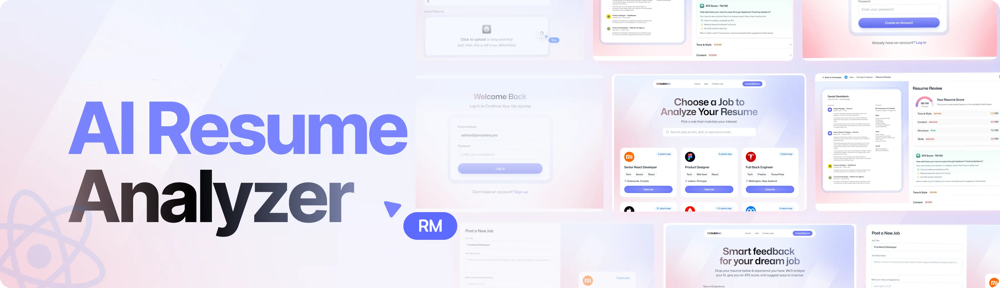

<div align="center">
  <br />
      
    </a>
  <br />

  <div>
    
        
        
    
  </div>

<h3 align="center">AI Resume Analyzer</h3>

</div>

## 📋 <a name="table">Conteúdos</a>

1. ✨ [Introdução](#introduction)
2. ⚙️ [Tecnologias Utilizadas](#tech-stack)
3. 🔋 [Funcionalidades](#features)
4. 🤸 [Início Rápido](#quick-start)

## <a name="introduction">✨ Introdução</a>

Este projeto é uma aplicação web desenvolvida com Angular, TailwindCSS e Puter.js que permite analisar currículos com o apoio de inteligência artificial. Ele oferece autenticação simples, upload e armazenamento seguro de currículos, além de comparar perfis com vagas de emprego por meio de avaliações inteligentes baseadas em IA. A aplicação também fornece feedbacks personalizados e pontuações ATS (Applicant Tracking System) para cada vaga analisada, tudo dentro de uma interface moderna, responsiva e de fácil reutilização.
## <a name="tech-stack">⚙️ Tecnologias Utilizadas</a>

- **[Angular](https://angular.dev/)**  é um framework web robusto e de código aberto para criar aplicações dinâmicas e escaláveis com TypeScript, utilizando arquitetura baseada em componentes e ferramentas integradas como roteamento e injeção de dependência.

- **[Puter.com](https://jsm.dev/resumind-puter)** é um sistema operacional de internet open-source, rápido, seguro e altamente extensível. Pode ser usado como uma nuvem pessoal com foco em privacidade para acessar arquivos e apps de qualquer lugar.

- **[Puter.js](https://jsm.dev/resumind-puterjs)** é um SDK leve que adiciona autenticação, armazenamento, banco de dados e IA (GPT, Claude, DALL·E, OCR…) diretamente no navegador — sem necessidade de backend.

- **[Tailwind CSS](https://tailwindcss.com/)** é um framework CSS com utilitários para criar interfaces personalizadas diretamente no HTML de forma ágil e moderna.

- **[TypeScript](https://www.typescriptlang.org/)** é um superconjunto do JavaScript com tipagem estática, melhorando a qualidade e a manutenção do código em projetos maiores.

## <a name="features">🔋 Funcionalidades</a>

👉 **Autenticação simples e conveniente**: Gerencie autenticação direto no navegador com Puter.js — sem necessidade de backend.

👉 **Upload e armazenamento de currículos**: Permita que os usuários façam upload e armazenem seus currículos com segurança.

👉 **Análise de currículos com IA**: Dada uma vaga, obtenha uma pontuação ATS com feedbacks personalizados para cada currículo.

👉 **Interface reutilizável e moderna**: Componentes consistentes e reutilizáveis para manter a aplicação bonita e organizada.

👉 **Reutilização de Código**: Aproveite uma base modular e componentes reutilizáveis para acelerar o desenvolvimento.

👉 **Compatibilidade com múltiplos dispositivos**: Design responsivo que funciona perfeitamente em todos os dispositivos.

👉 **UI/UX Moderno**: Layout limpo e responsivo com Tailwind CSS e shadcn/ui para uma ótima experiência do usuário.

E muito mais, incluindo arquitetura de código otimizada.

## <a name="quick-start">🤸 Início Rápido</a>

Siga os passos abaixo para rodar o projeto localmente:

**Pré-requisitos**

Certifique-se de ter os seguintes itens instalados:

- [Git](https://git-scm.com/)
- [Node.js](https://nodejs.org/en)
- [npm](https://www.npmjs.com/) (Gerenciador de pacotes do Node)

**Clonando o Repositório**

```bash
git clone https://github.com/Rafael01Gx/resume-analyzer-ai.git
cd resume-analyzer-ai
